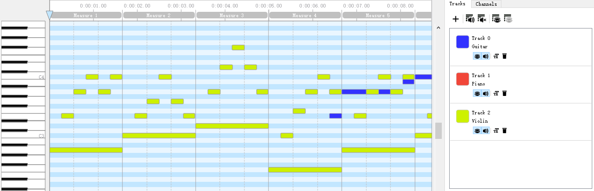

# Instrument Classification
> Automatic instrument classification from music

We intend to perform automatic identification of instrument classes from monophonic and polyphonic music audio via machine learning method. We only focus on three different classes of instrument, which are piano, guitar and strings.


## Database

We build our own audio database based on a selection from 130,000 midi files as follows: 
1. Select midi files that have been already labeled by 1~3 of the instruments above.
2. Extract and saperate them either into single-track midi files (monophonic) or into multi-track midi files (polyphonic). 
3. Use instrument sounds sampler, such as Kontakt 5, to render midi files into music.
4. We label our data during the music generation process.

Raw data retrived from https://www.reddit.com/r/WeAreTheMusicMakers/comments/3ajwe4/the_largest_midi_collection_on_the_internet/

Midi:
> A kind of file format, containing digital information of music



Instrument sampler
> Make inputs like midi generate sound

## Importance

1. Few music database are available for analysis use, mostly in the form of songs. Extracting more information from songs will significantly contribute to the industry.
2. Bands, singers and studios spend tremendous time on making existing music back into scores or midi.
3. A potential for automatic accompaniment generation.

## Tools

Mido - MIDI Objects for Python

```sh
import mido
```

Scikit-learn

fast.ai

Kontact 5

## Group Members

_Wang Haoran_
_1701213100_
_qwerjeff_

_Zhe Wang_
_1791213114_
_dragonwdl_

_Daniel Kwesi Wobil_
_1701213207_
_answob_

_Yizhe Ren_
_1701213087_
_engerous_

