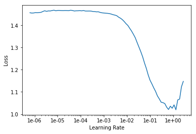

```python
import fastai
from fastai import *
from fastai.vision import *
from fastai.tabular import *  # Quick access to tabular functionality
from sklearn.model_selection import train_test_split
```

## Features: 20 MFCCs, 20 first-derivative of MFCCs, 5 Spectrals


```python
usecols_21 = ['MFCC01', 'MFCC02', 'MFCC03', 'MFCC04', 'MFCC05', 'MFCC06', 'MFCC07', 'MFCC08', 'MFCC09', 'MFCC10', 'MFCC11', 'MFCC12', 'MFCC13', 'MFCC14', 'MFCC15', 'MFCC16', 'MFCC17', 'MFCC18', 'MFCC19', 'MFCC20', 'Class']
usecols_41 = ['MFCC01', 'MFCC02', 'MFCC03', 'MFCC04', 'MFCC05', 'MFCC06', 'MFCC07', 'MFCC08', 'MFCC09', 'MFCC10', 'MFCC11', 'MFCC12', 'MFCC13', 'MFCC14', 'MFCC15', 'MFCC16', 'MFCC17', 'MFCC18', 'MFCC19', 'MFCC20', 'MFCC_delta01', 'MFCC_delta02', 'MFCC_delta03', 'MFCC_delta04', 'MFCC_delta05', 'MFCC_delta06', 'MFCC_delta07', 'MFCC_delta08', 'MFCC_delta09', 'MFCC_delta10', 'MFCC_delta11', 'MFCC_delta12', 'MFCC_delta13', 'MFCC_delta14', 'MFCC_delta15', 'MFCC_delta16', 'MFCC_delta17', 'MFCC_delta18', 'MFCC_delta19', 'MFCC_delta20', 'Class']
usecols_41 = ['MFCC01', 'MFCC02', 'MFCC03', 'MFCC04', 'MFCC05', 'MFCC06', 'MFCC07', 'MFCC08', 'MFCC09', 'MFCC10', 'MFCC11', 'MFCC12', 'MFCC13', 'MFCC14', 'MFCC15', 'MFCC16', 'MFCC17', 'MFCC18', 'MFCC19', 'MFCC20', 'MFCC_delta01', 'MFCC_delta02', 'MFCC_delta03', 'MFCC_delta04', 'MFCC_delta05', 'MFCC_delta06', 'MFCC_delta07', 'MFCC_delta08', 'MFCC_delta09', 'MFCC_delta10', 'MFCC_delta11', 'MFCC_delta12', 'MFCC_delta13', 'MFCC_delta14', 'MFCC_delta15', 'MFCC_delta16', 'MFCC_delta17', 'MFCC_delta18', 'MFCC_delta19', 'MFCC_delta20', 'Class']
```


```python
path = '/root'
df = pd.read_csv('/root/msec_mfcc_nonsilent.csv', usecols = usecols_41)
train_df, valid_df = train_test_split(df)
train_df.tail()
```


<div>
<style scoped>
    .dataframe tbody tr th:only-of-type {
        vertical-align: middle;
    }

    .dataframe tbody tr th {
        vertical-align: top;
    }

    .dataframe thead th {
        text-align: right;
    }
</style>
<table border="1" class="dataframe">
  <thead>
    <tr style="text-align: right;">
      <th></th>
      <th>MFCC01</th>
      <th>MFCC02</th>
      <th>MFCC03</th>
      <th>MFCC04</th>
      <th>MFCC05</th>
      <th>MFCC06</th>
      <th>MFCC07</th>
      <th>MFCC08</th>
      <th>MFCC09</th>
      <th>MFCC10</th>
      <th>...</th>
      <th>MFCC_delta12</th>
      <th>MFCC_delta13</th>
      <th>MFCC_delta14</th>
      <th>MFCC_delta15</th>
      <th>MFCC_delta16</th>
      <th>MFCC_delta17</th>
      <th>MFCC_delta18</th>
      <th>MFCC_delta19</th>
      <th>MFCC_delta20</th>
      <th>Class</th>
    </tr>
  </thead>
  <tbody>
    <tr>
      <th>7566</th>
      <td>-623.986962</td>
      <td>171.999459</td>
      <td>71.872040</td>
      <td>21.720318</td>
      <td>9.263828</td>
      <td>-1.223066</td>
      <td>-3.965144</td>
      <td>-0.210722</td>
      <td>-5.282595</td>
      <td>-13.754732</td>
      <td>...</td>
      <td>0.001008</td>
      <td>-0.007516</td>
      <td>-0.006467</td>
      <td>-0.003224</td>
      <td>-0.003534</td>
      <td>-0.002909</td>
      <td>0.001973</td>
      <td>0.004103</td>
      <td>-0.000633</td>
      <td>2</td>
    </tr>
    <tr>
      <th>2501</th>
      <td>-309.825480</td>
      <td>143.641373</td>
      <td>-21.801265</td>
      <td>21.942721</td>
      <td>20.128781</td>
      <td>13.287995</td>
      <td>17.403127</td>
      <td>14.121780</td>
      <td>13.158946</td>
      <td>12.971298</td>
      <td>...</td>
      <td>0.526601</td>
      <td>0.185795</td>
      <td>0.222595</td>
      <td>0.005254</td>
      <td>-0.193304</td>
      <td>-0.212205</td>
      <td>-0.089623</td>
      <td>-0.065902</td>
      <td>-0.211232</td>
      <td>2</td>
    </tr>
    <tr>
      <th>5672</th>
      <td>-599.813874</td>
      <td>162.164221</td>
      <td>93.778812</td>
      <td>55.092892</td>
      <td>42.331028</td>
      <td>26.904240</td>
      <td>13.506857</td>
      <td>12.611757</td>
      <td>10.626413</td>
      <td>0.757259</td>
      <td>...</td>
      <td>0.075538</td>
      <td>0.444945</td>
      <td>0.240737</td>
      <td>-0.248581</td>
      <td>-0.396535</td>
      <td>-0.179960</td>
      <td>-0.017341</td>
      <td>-0.028708</td>
      <td>-0.030098</td>
      <td>2</td>
    </tr>
    <tr>
      <th>4666</th>
      <td>-761.547931</td>
      <td>116.665295</td>
      <td>52.558674</td>
      <td>22.422087</td>
      <td>16.306704</td>
      <td>4.734597</td>
      <td>-8.219314</td>
      <td>-13.676851</td>
      <td>-16.229516</td>
      <td>-17.614693</td>
      <td>...</td>
      <td>0.499126</td>
      <td>0.416849</td>
      <td>0.208211</td>
      <td>0.114092</td>
      <td>0.058175</td>
      <td>-0.214615</td>
      <td>-0.510880</td>
      <td>-0.496397</td>
      <td>-0.326911</td>
      <td>2</td>
    </tr>
    <tr>
      <th>3449</th>
      <td>-320.932113</td>
      <td>156.872793</td>
      <td>-32.379042</td>
      <td>49.476503</td>
      <td>4.194986</td>
      <td>18.936419</td>
      <td>5.512803</td>
      <td>0.282368</td>
      <td>1.504447</td>
      <td>3.965386</td>
      <td>...</td>
      <td>0.115879</td>
      <td>-0.116351</td>
      <td>0.091803</td>
      <td>-0.056881</td>
      <td>0.005115</td>
      <td>-0.098158</td>
      <td>-0.018486</td>
      <td>0.009138</td>
      <td>-0.009866</td>
      <td>2</td>
    </tr>
  </tbody>
</table>
<p>5 rows × 41 columns</p>
</div>


```python
path = '/root'
dep_var = 'Class'
#cat_names = ['Class']
data = TabularDataBunch.from_df(path, train_df, valid_df, dep_var, 
                                tfms=[FillMissing, Categorify], cat_names=None)
```


```python
learn = get_tabular_learner(data, layers=[20], metrics=accuracy)
```


```python
learn.lr_find()
learn.recorder.plot()
```

    LR Finder complete, type {learner_name}.recorder.plot() to see the graph.
    





```python
learn.fit(8, 0.05)
```

    Total time: 00:09
    epoch  train_loss  valid_loss  accuracy
    1      0.085720    0.090742    0.970018  (00:01)
    2      0.076532    0.067959    0.978836  (00:01)
    3      0.082301    0.064496    0.978836  (00:01)
    4      0.070542    0.057943    0.981305  (00:01)
    5      0.075540    0.064264    0.978836  (00:01)
    6      0.069713    0.070506    0.976367  (00:01)
    7      0.073813    0.072434    0.975309  (00:01)
    8      0.086864    0.071680    0.977425  (00:01)
    
    
