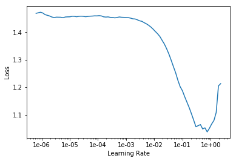

```python
import fastai
from fastai import *
from fastai.vision import *
from fastai.tabular import *  # Quick access to tabular functionality
from sklearn.model_selection import train_test_split
```

## Features: 20 MFCCs, 20 first-derivative of MFCCs, 5 Spectrals


```python
usecols_21 = ['MFCC01', 'MFCC02', 'MFCC03', 'MFCC04', 'MFCC05', 'MFCC06', 'MFCC07', 'MFCC08', 'MFCC09', 'MFCC10', 'MFCC11', 'MFCC12', 'MFCC13', 'MFCC14', 'MFCC15', 'MFCC16', 'MFCC17', 'MFCC18', 'MFCC19', 'MFCC20', 'Class']
usecols_41 = ['MFCC01', 'MFCC02', 'MFCC03', 'MFCC04', 'MFCC05', 'MFCC06', 'MFCC07', 'MFCC08', 'MFCC09', 'MFCC10', 'MFCC11', 'MFCC12', 'MFCC13', 'MFCC14', 'MFCC15', 'MFCC16', 'MFCC17', 'MFCC18', 'MFCC19', 'MFCC20', 'MFCC_delta01', 'MFCC_delta02', 'MFCC_delta03', 'MFCC_delta04', 'MFCC_delta05', 'MFCC_delta06', 'MFCC_delta07', 'MFCC_delta08', 'MFCC_delta09', 'MFCC_delta10', 'MFCC_delta11', 'MFCC_delta12', 'MFCC_delta13', 'MFCC_delta14', 'MFCC_delta15', 'MFCC_delta16', 'MFCC_delta17', 'MFCC_delta18', 'MFCC_delta19', 'MFCC_delta20', 'Class']
usecols_41 = ['MFCC01', 'MFCC02', 'MFCC03', 'MFCC04', 'MFCC05', 'MFCC06', 'MFCC07', 'MFCC08', 'MFCC09', 'MFCC10', 'MFCC11', 'MFCC12', 'MFCC13', 'MFCC14', 'MFCC15', 'MFCC16', 'MFCC17', 'MFCC18', 'MFCC19', 'MFCC20', 'MFCC_delta01', 'MFCC_delta02', 'MFCC_delta03', 'MFCC_delta04', 'MFCC_delta05', 'MFCC_delta06', 'MFCC_delta07', 'MFCC_delta08', 'MFCC_delta09', 'MFCC_delta10', 'MFCC_delta11', 'MFCC_delta12', 'MFCC_delta13', 'MFCC_delta14', 'MFCC_delta15', 'MFCC_delta16', 'MFCC_delta17', 'MFCC_delta18', 'MFCC_delta19', 'MFCC_delta20', 'Class']
```


```python
path = '/root'
df = pd.read_csv('/root/msec_mfcc_nonsilent.csv', usecols = usecols_41)
train_df, valid_df = train_test_split(df)
train_df.tail()
```


<div>
<style scoped>
    .dataframe tbody tr th:only-of-type {
        vertical-align: middle;
    }

    .dataframe tbody tr th {
        vertical-align: top;
    }

    .dataframe thead th {
        text-align: right;
    }
</style>
<table border="1" class="dataframe">
  <thead>
    <tr style="text-align: right;">
      <th></th>
      <th>MFCC01</th>
      <th>MFCC02</th>
      <th>MFCC03</th>
      <th>MFCC04</th>
      <th>MFCC05</th>
      <th>MFCC06</th>
      <th>MFCC07</th>
      <th>MFCC08</th>
      <th>MFCC09</th>
      <th>MFCC10</th>
      <th>...</th>
      <th>MFCC_delta12</th>
      <th>MFCC_delta13</th>
      <th>MFCC_delta14</th>
      <th>MFCC_delta15</th>
      <th>MFCC_delta16</th>
      <th>MFCC_delta17</th>
      <th>MFCC_delta18</th>
      <th>MFCC_delta19</th>
      <th>MFCC_delta20</th>
      <th>Class</th>
    </tr>
  </thead>
  <tbody>
    <tr>
      <th>3387</th>
      <td>-588.893281</td>
      <td>61.872196</td>
      <td>36.173183</td>
      <td>12.222954</td>
      <td>0.070097</td>
      <td>-1.740603</td>
      <td>-0.014241</td>
      <td>0.568345</td>
      <td>-1.057054</td>
      <td>-4.374354</td>
      <td>...</td>
      <td>-0.096444</td>
      <td>-0.112696</td>
      <td>-0.148544</td>
      <td>-0.147029</td>
      <td>-0.114402</td>
      <td>-0.091828</td>
      <td>-0.084878</td>
      <td>-0.075201</td>
      <td>-0.063666</td>
      <td>2</td>
    </tr>
    <tr>
      <th>8510</th>
      <td>-450.539790</td>
      <td>171.946676</td>
      <td>2.740914</td>
      <td>43.658501</td>
      <td>2.702106</td>
      <td>-0.092322</td>
      <td>-6.469917</td>
      <td>-9.582212</td>
      <td>-1.665914</td>
      <td>-16.919125</td>
      <td>...</td>
      <td>-0.294263</td>
      <td>-0.235705</td>
      <td>-0.247688</td>
      <td>-0.262883</td>
      <td>0.064782</td>
      <td>-0.001769</td>
      <td>-0.282378</td>
      <td>-0.249099</td>
      <td>-0.262339</td>
      <td>2</td>
    </tr>
    <tr>
      <th>1631</th>
      <td>-86.284791</td>
      <td>123.796719</td>
      <td>-15.424216</td>
      <td>37.071017</td>
      <td>1.780201</td>
      <td>12.387107</td>
      <td>-2.336179</td>
      <td>11.731289</td>
      <td>10.421116</td>
      <td>14.463658</td>
      <td>...</td>
      <td>-0.127199</td>
      <td>-0.104008</td>
      <td>-0.186121</td>
      <td>0.327396</td>
      <td>-0.014838</td>
      <td>0.127096</td>
      <td>-0.158492</td>
      <td>-0.121895</td>
      <td>-0.037081</td>
      <td>1</td>
    </tr>
    <tr>
      <th>5990</th>
      <td>-396.047577</td>
      <td>195.191384</td>
      <td>-18.154864</td>
      <td>12.863795</td>
      <td>-0.935496</td>
      <td>-2.141373</td>
      <td>10.411853</td>
      <td>-3.263540</td>
      <td>-4.767152</td>
      <td>-7.187055</td>
      <td>...</td>
      <td>-0.179623</td>
      <td>0.041105</td>
      <td>0.043751</td>
      <td>-0.143819</td>
      <td>0.203854</td>
      <td>-0.355674</td>
      <td>-0.023008</td>
      <td>0.529479</td>
      <td>-0.046153</td>
      <td>2</td>
    </tr>
    <tr>
      <th>3754</th>
      <td>-509.628014</td>
      <td>204.924660</td>
      <td>103.526238</td>
      <td>34.753842</td>
      <td>10.553188</td>
      <td>7.748897</td>
      <td>11.247462</td>
      <td>10.753807</td>
      <td>6.223862</td>
      <td>2.410662</td>
      <td>...</td>
      <td>-0.198177</td>
      <td>-0.536970</td>
      <td>-0.342223</td>
      <td>-0.111721</td>
      <td>-0.091470</td>
      <td>-0.214756</td>
      <td>0.050244</td>
      <td>0.055742</td>
      <td>0.055125</td>
      <td>2</td>
    </tr>
  </tbody>
</table>
<p>5 rows × 41 columns</p>
</div>


```python
path = '/root'
dep_var = 'Class'
#cat_names = ['Class']
data = TabularDataBunch.from_df(path, train_df, valid_df, dep_var, 
                                tfms=[FillMissing, Categorify], cat_names=None)
```


```python
learn = get_tabular_learner(data, ps=[0.5], layers=[20], metrics=accuracy)
```


```python
learn.lr_find()
learn.recorder.plot()
```

    LR Finder complete, type {learner_name}.recorder.plot() to see the graph.
    





```python
learn.fit(20, 0.001)
```

    Total time: 00:17
    epoch  train_loss  valid_loss  accuracy
    1      0.145718    0.112236    0.964727  (00:00)
    2      0.139948    0.111541    0.964021  (00:00)
    3      0.129767    0.108192    0.965079  (00:00)
    4      0.123624    0.108264    0.965079  (00:00)
    5      0.127745    0.105769    0.966490  (00:00)
    6      0.126452    0.106486    0.965785  (00:00)
    7      0.123618    0.107978    0.964374  (00:00)
    8      0.130236    0.104758    0.967196  (00:00)
    9      0.126302    0.105482    0.966138  (00:00)
    10     0.129789    0.103588    0.966490  (00:00)
    11     0.130023    0.103711    0.966490  (00:00)
    12     0.118543    0.102683    0.965785  (00:00)
    13     0.120234    0.103202    0.965785  (00:00)
    14     0.122837    0.101986    0.966843  (00:00)
    15     0.123732    0.102206    0.965432  (00:00)
    16     0.126771    0.100326    0.966843  (00:00)
    17     0.126410    0.100488    0.967196  (00:00)
    18     0.123131    0.100546    0.965079  (00:00)
    19     0.125713    0.101786    0.965079  (00:00)
    20     0.118950    0.100062    0.967196  (00:00)
    
    
